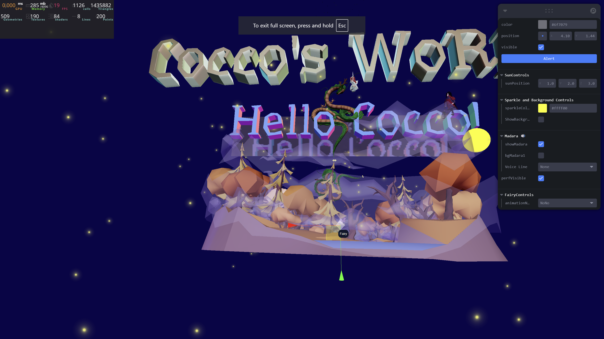
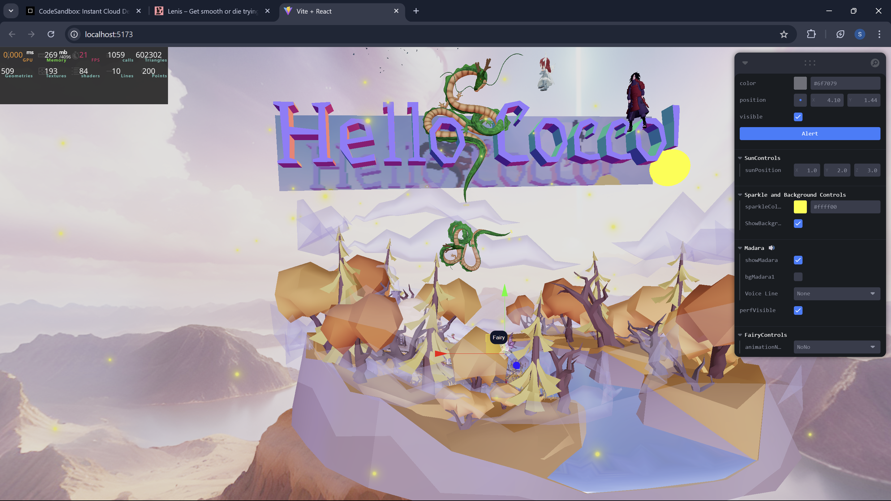

# 🧚‍♀️ Cocco's World (More like Hello world)

> 🧪 A playground of experiments and learnings with `Three.js`, `React Three Fiber`, and `Blender`.  
> A journey into the world of interactive 3D experiences — one scene at a time.

---


### 🌐 **Live Demo**
🚀 [coccos-world.netlify.app](https://coccos-world.netlify.app)

## 🎥 Project Videos

### 🔹 Demo 1: Scene Interaction Preview  
<iframe width="560" height="315" src="https://www.youtube.com/embed/G2m8G8DD-as?si=a4NmDTuFFH_27nZR" title="YouTube video player" frameborder="0" allow="accelerometer; autoplay; clipboard-write; encrypted-media; gyroscope; picture-in-picture; web-share" referrerpolicy="strict-origin-when-cross-origin" allowfullscreen></iframe>

### 🔹 Demo 2: Animation Preview and Tweak Controls  
<iframe width="560" height="315" src="https://www.youtube.com/embed/UJzaEgI9rnQ?si=2YA10g-sdiJd637F" title="YouTube video player" frameborder="0" allow="accelerometer; autoplay; clipboard-write; encrypted-media; gyroscope; picture-in-picture; web-share" referrerpolicy="strict-origin-when-cross-origin" allowfullscreen></iframe>


---

## 🧠 About

This project is my personal **3D lab** — a place where I explore:

- 🎨 Loading and animating **Blender models**
- 🌀 Creating smooth interactions using **React Three Fiber**
- 💡 Playing with lighting, materials, cameras, shadows, and scene depth
- 🔁 Learning best practices for structuring 3D components in React

> If it's 3D and on the web, this is where I tinker with it!

---

## 🚀 Tech Stack

| Frontend | 3D/Rendering | Assets |
|----------|--------------|--------|
| `React.js` | `Three.js` | `Blender (GLTF)` |
| `React Three Fiber` | `Drei` | `Custom shaders` *(LEARNING🧓)* |
| `JavaScript (ES6)` | `Canvas/WebGL` | — |

---

## 📸 Screenshots

### 🧚 Scene Preview




---

## 🛠️ How to Run Locally(try playing with it yourself)

```bash
git clone https://github.com/srijan123/coccos-world.git
cd coccos-world
npm install
npm run dev
