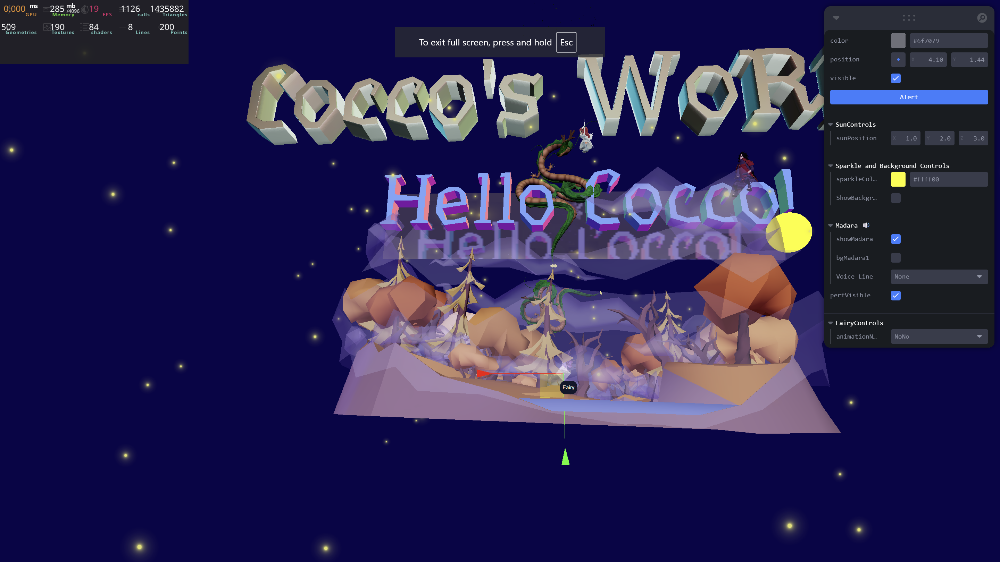
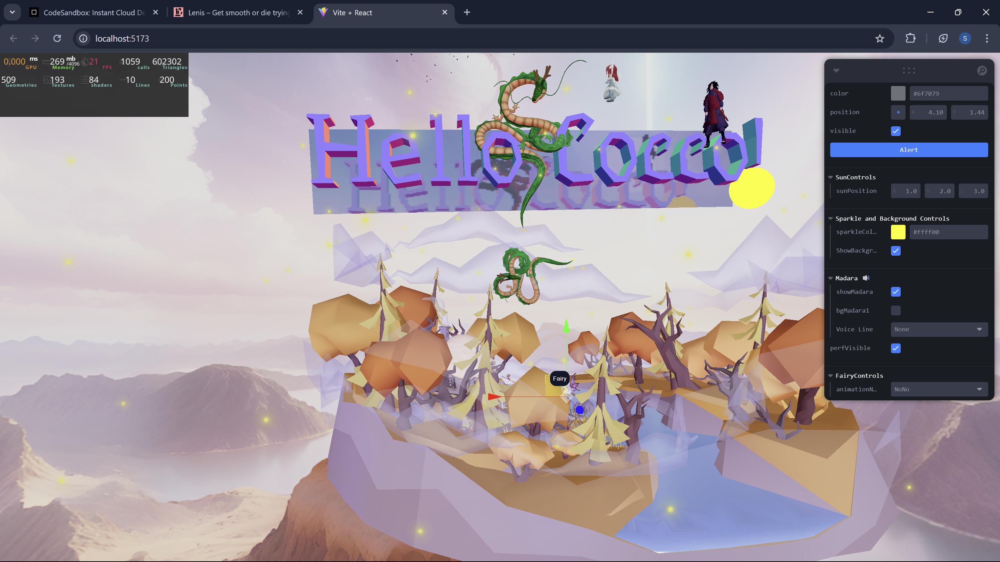
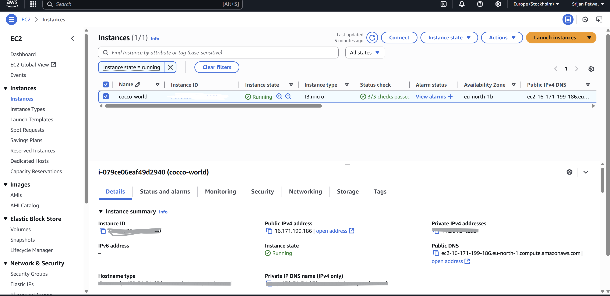

# 🧚‍♀️ Cocco's World (More like Hello world😄)
>[!IMPORTANT]
> 🧪 A playground of experiments and learnings with `Three.js`, `React Three Fiber`, and `Blender`.  
> A journey into the world of interactive 3D experiences — one scene at a time.

#### Docker Hub repo
[](https://hub.docker.com/repository/docker/srijan5/cocco-world/general)


---

## 📸 Screenshots

### 🧚 Scene Preview




---


### 🌐 **Live Demo with Netlify**
🚀 [coccos-world.netlify.app](https://coccos-world.netlify.app)

## ☁️ **Live Demo with AWS EC2 Deployment**
>[!NOTE]
> 🚀 **Now hosted on a custom EC2 instance via Docker!**  
> This deployment showcases my growing expertise in DevOps — moving beyond platforms like Netlify for a more hands-on infrastructure experience.

🔗 [http://16.171.199.186:3000](http://16.171.199.186:3000)  
_(Hosted on AWS EC2 — may take a few seconds to wake up if idle)_

---


### EC2- Instance Screenshot




---


### 💡About Why AWS EC2 Deployment?

- 🛠️ To **learn and practice real-world deployment**.
- 🐳 Run the app inside a **Docker container** on a **Linux VM**.
- 🔐 Handle **firewall settings, ports, and SSH access** manually.
- 🌍 Gain **deeper insight** into how full-stack apps run on the cloud.

---

### 🧪 Tech Stack Used

- Amazon EC2 (Ubuntu)
- Docker (Containerized deployment)
- Public IP with exposed port `3000`


---

### 📦 Deployed Container Command

```bash
docker run --restart=always -p 3000:3000 srijan5/cocco-world

```


## 🎥 Project Videos

### 🔹 Demo 1: Scene Interaction Preview  
[🎞️  Watch Demo 1](https://youtu.be/G2m8G8DD-as)

### 🔹 Demo 2: Animation + Tweak Controls
[🎬  Watch Demo 2](https://youtu.be/UJzaEgI9rnQ)

>[!NOTE]
>Credit for all the pre-built models goes to their respective creaters.I tweaked them, gave some of them animations and optimized them a bit. All of them are under various free-use licenses.

---


## 🧠 About

This project is my personal **3D lab** — a place where I explore:

- 🎨 Loading and animating **Blender models**
- 🌀 Creating smooth interactions using **React Three Fiber**
- 💡 Playing with lighting, materials, cameras, shadows, and scene depth
- 🔁 Learning best practices for structuring 3D components in React

>[!NOTE]
> If it's 3D and on the web, this is where I tinker with it!


---
## 🚀 Tech Stack

| Frontend | 3D/Rendering | Assets |
|----------|--------------|--------|
| `React.js` | `Three.js` | `Blender (GLTF)` |
| `React Three Fiber` | `Drei` | `Custom shaders` *(LEARNING🧓)* |
| `JavaScript (ES6)` | `Canvas/WebGL` | — |

---


## 🛠️ How to Run Locally(try playing with it yourself)

```bash
git clone https://github.com/Srijan-Petwal/hello-cocco.git
cd coccos-world
npm install
npm run dev

```
---


## 🐳 Now Runs in Docker!

>[!TIP]
> You can now run the entire project inside a Docker container — no need to install Node, Vite, or any dependencies manually.
>This makes previewing the project locally much easier and cleaner. Ideal for sandbox testing, sharing, or running in isolated environments.
---

## 🧰 What It Takes to Run Locally with Docker

To run this project locally using Docker, you need just a few things set up:

#### ✅ Prerequisites

- **Docker Desktop installed**  
  → [Download Docker](https://www.docker.com/products/docker-desktop)  
- **Working internet connection** (for the first-time image pull)

---


#### 🚀 Steps to Run in Docker

```bash
# Pull and run the container
docker run -it -p 3000:3000 srijan5/cocco-world
```

